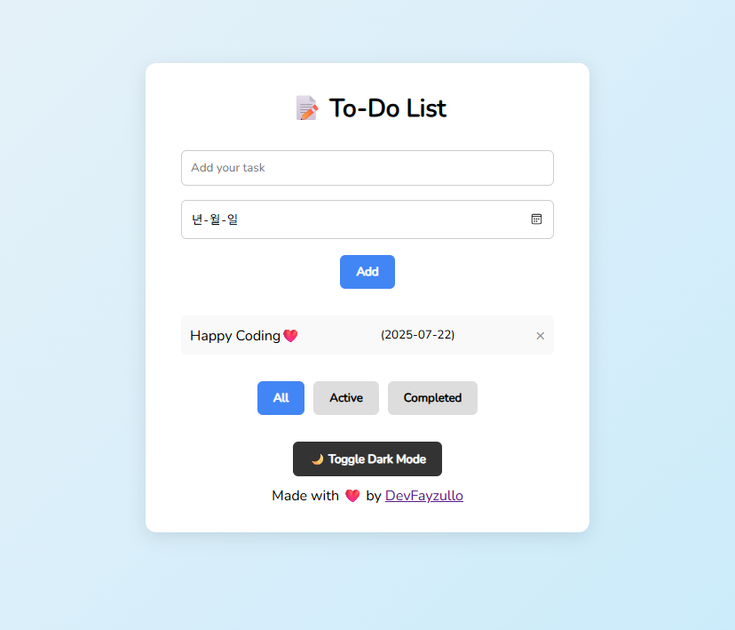

# 📝 To-Do App

A modern, responsive, and fully-functional To-Do List application built with HTML, CSS, and JavaScript. This app allows users to manage tasks efficiently, with features like filtering, local storage persistence, dark mode, and more.

---

## 🚀 Features

- ✅ Add and delete tasks
- ✅ Mark tasks as completed
- ✅ Task filtering (All / Active / Completed)
- ✅ Enter key support to add tasks quickly
- ✅ Set deadlines using date input
- ✅ Responsive design for all devices
- ✅ Dark mode toggle
- ✅ Persistent storage using LocalStorage

---

## 📸 Preview



---

## 🛠️ Technologies Used

- HTML5
- CSS3
- JavaScript (Vanilla)

---

## 📁 Project Structure

```
To-Do-App/
├── css/
│   └── style.css
├── img/
│   ├── to-do.png
│   └── ... (other icons)
├── javascript/
│   └── script.js
├── index.html
└── README.md
```

---

## ⚙️ How to Use

1. **Clone or download** this repository.
2. Open `index.html` in any modern web browser.
3. Start adding tasks, mark them done, filter them, and enjoy the dark mode!

> 💡 Tip: Your tasks will remain saved even after closing the browser, thanks to LocalStorage.

---

## 🌗 Dark Mode

Click the **"Toggle Dark Mode"** button to switch between light and dark themes instantly.

---

## 📌 Future Improvements

- [ ] Add task categories or labels
- [ ] Drag-and-drop reordering
- [ ] Sync across devices (using backend or cloud storage)

---

## 📄 License

This project is open source and available under the [MIT License](LICENSE).

## 🧑‍💻 Author

Built with ❤️ by [DevFayzullo](https://github.com/DevFayzullo).

---

Happy coding! 🚀

---

## 🙌 Acknowledgements

Inspired by simple productivity tools and refined with practical feedback.

Feel free to contribute, fork, or share!
